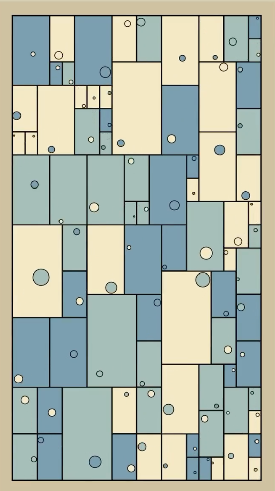
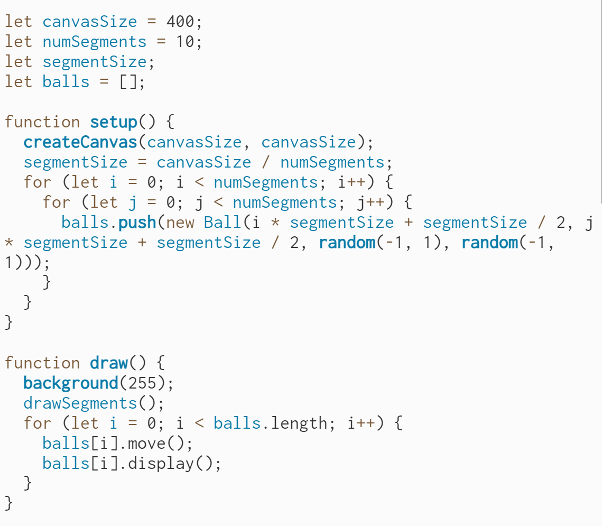
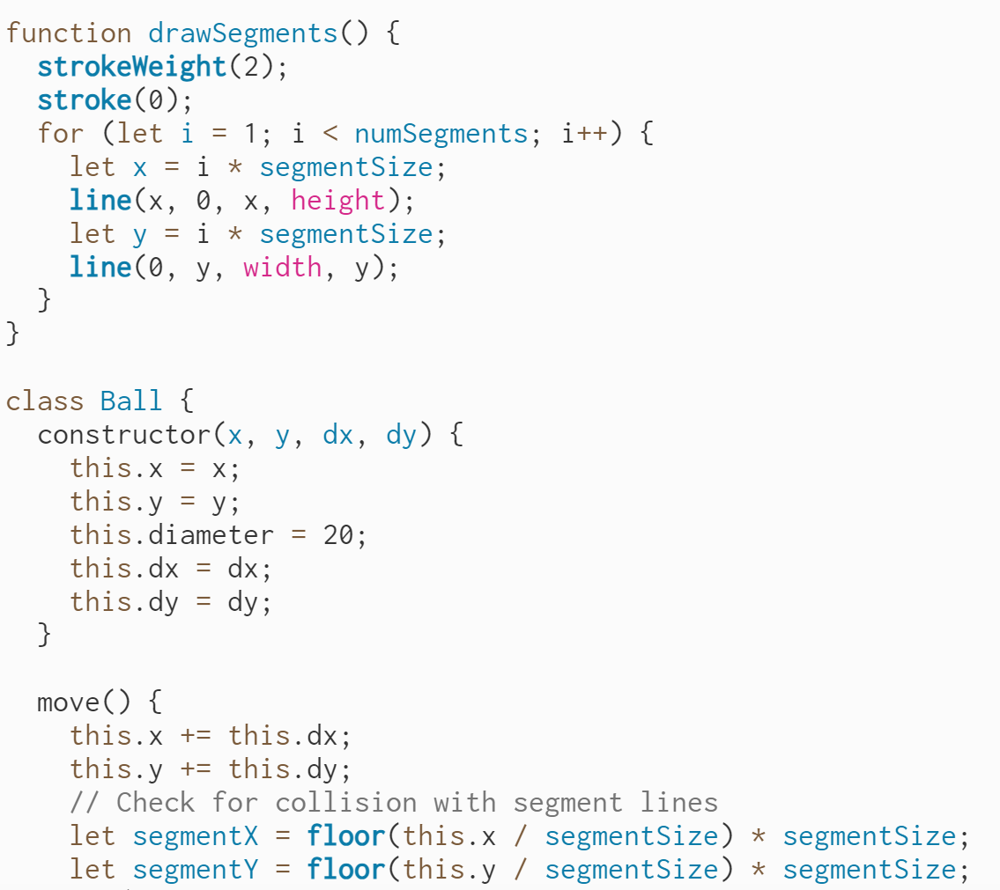
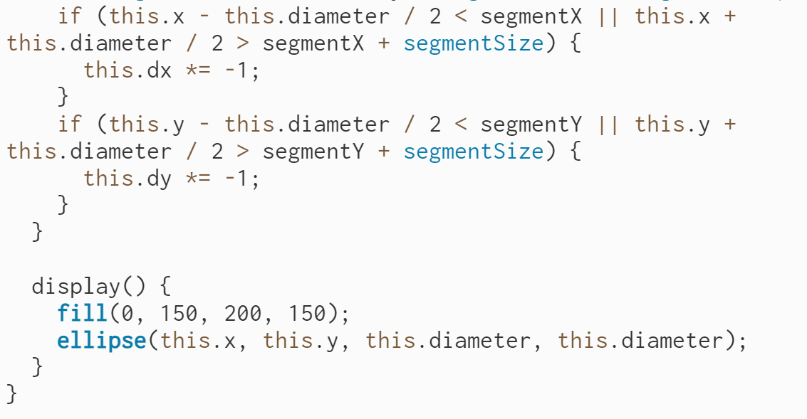
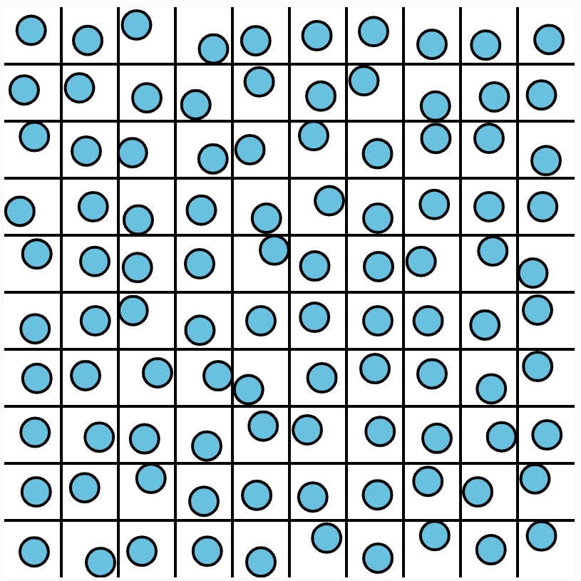

# qguo0666_9103_tut8
my first repository for IDEA9103

This is my first local change to the repo!

# Heading1
## Heading2
### Heading3
#### Heading4
##### Heading5
###### Heading6
**Bold Text** or __Bold Text__
*Italic Text* or _Italic Text_
- Item 1
- Item 2
  - Subitem 2.1
  - Subitem 2.2
1. First Item
2. Second Item
3. Third Item
4. Third Item

[Link Text](https://www.google.com)

# Attention! Next, let's start Week 8 Quiz!!!

- Imaging Technique Inspiration:

I hope to include "objects moving or freely moving within a designated area according to certain rules" in my project.

I hope to include "objects moving or freely moving within a designated area according to certain rules" in my project. In my idea, multiple objects moving in a designated area according to a certain pattern (such as multiple small balls arranged in a row and quickly moving along the edges of the area) can form a certain image or trajectory. Beneficial for expressing color blocks.

- Coding Technique Exploration

In my opinion, the final product presented is a work composed of multiple fragments. So, placing multiple freely moving objects of the same color in each segment, these multiple objects can move within the specified segment, and the colors of this segment can be presented to the viewer in the form of animation.
And according to my observation, among the artworks available for us to choose from, except for "Pablo Picasso Dove of peace", there are also rich color blocks. If these color blocks (especially small and densely packed ones) are moved, I think they can produce a certain visual effect.

